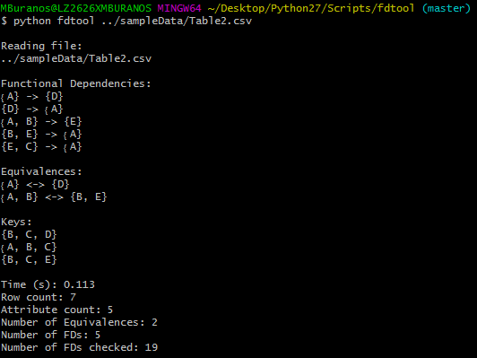

#### README: Algorithm to mine for functional dependencies, equivalences and candidate keys

##### Description: 
FDTool is a Python command-line application that mines functional dependencies, equivalences and
candidate keys from datasets read in from .csv, .txt, and .pkl files.

##### Dependencies:

  1. [Python2](https://www.python.org/) (version 2.7.8 or later recommended)

  2. [Pandas](https://pandas.pydata.org/); pip install pandas

##### Configuration:

Edit ```REPO\fdtool\config.py``` prior to building setup to
change preset time limit or max k-level. Include (optional) custom outfile
name after command to run application.

##### Build setup:
```
$ git clone https://github.com/USEPA/FDTool.git
$ cd FDTool
$ python setup.py install
```

##### Run Application:
```	
$ fdtool /path/to/file
```

##### Output:


##### Notes:
Module ```REPO/fdtool/modules/dbschema``` released under C-FSL license 
and copyright held by Elmar Stellnberger.


